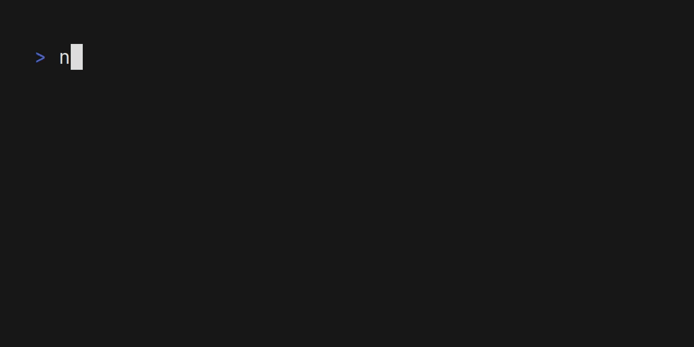

# web_crawler
Simply, a JavaScript web crawler.

<picture>
  
</picture>

# Overview
 > Crawling is the technical term for automatically accessing a website and obtaining data via a software program.
 
 The program in this repository is a crawler that takes an URL as an argument and indexes all the internal links on the website that URL leads to, then prints the results to the screen as well as writes it to a `crawled.csv` file.

# Usage
 You need a JavaScript runtime installed in order to run this program (something like [node](https://nodejs.org/en), [bun](https://bun.sh/) or [deno](https://deno.com/)). 
 
 The remaining of this guide will assume you are using `node` with `npm` (node package manager). If you are on a different runtime environment, it shouldn't be difficult to adapt the commands accordingly.

 Firstly, clone this repository (preferably via SSH):

 ```sh
git clone git@github.com:edbar42/web_crawler.git
```

Then, `cd` into the directory where you you cloned the repo and run `npm -i`.

Execute the program by running `npm run start` followed by the URL of the target website. Depending on your terminal environment,you may need to wrap the URL in double quotes.

Example command:

```sh
npm run start "https://wagslane.dev"
```

Running this program without the proper number of CLI arguments will result in an error.

If no errors ocurred, you shoud have the number of internal links and their count shown on your screen, as well as in a file named `crawled.csv`.
